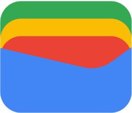

#  Google Wallet Clone

## Overview

This project is a Google Wallet clone developed using the Flutter framework. It aims to replicate the key features and user interface of Google Wallet, providing a seamless and user-friendly digital wallet experience for users.

## Image and File Credits

All images and files used in this project are sourced from the official Google Wallet software and are used for educational and non-commercial purposes only. They are the property of their respective owners and are used here solely for the purpose of creating a functional and visually similar application.

## Acknowledgments

- Thanks to the Flutter and Dart communities for providing excellent documentation and support.